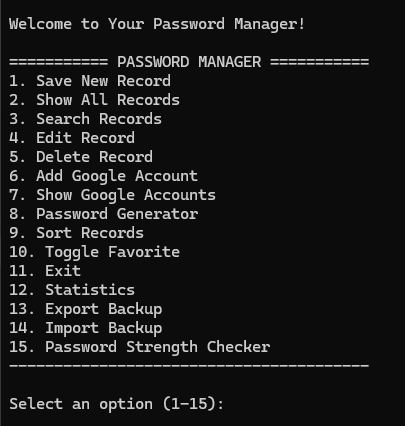
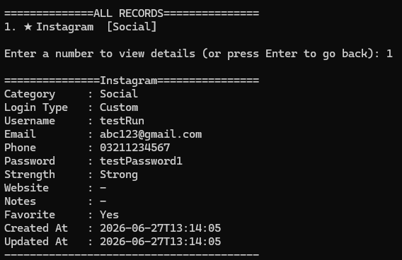
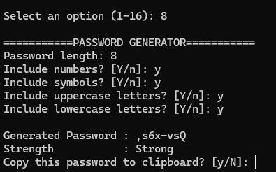

# 🔐 Password Manager

A clean, modular, console-based Password Manager built with Python 3 - designed as a real-world portfolio project rather than a single-file beginner script.

The project follows Object Oriented design principles with a clear separation between **data models**, **persistence/business logic**, **utility functions**, and the **presentation layer** (CLI menus).

---

## ✨ Features

### Core Features
- **Save New Record** - store credentials with title, category, and login method (custom or Google-linked).
- **Show All Records** - view a clean list of saved entries; select one to see full details (no raw JSON dumps).
- **Search Records** - partial, case-insensitive search across title, category, email, and website (e.g. searching `git` matches both *Github* and *GitLab*).
- **Edit Record** - update any field; leave input blank to keep the existing value. `updated_at` is refreshed automatically.
- **Delete Record** - requires explicit confirmation before removing data.
- **Google Account Management** - maintain a separate list of linked Google accounts, with duplicate-email protection.
- **Password Generator** - cryptographically secure password generation (via Python's `secrets` module) with configurable length and character sets (uppercase, lowercase, numbers, symbols). Can be used standalone or while creating a new record. Includes an option to **copy the generated password to clipboard** right after it's created.
- **Sort Records** - by title, category, newest, oldest, or favorites-first.
- **Favorites** - mark/unmark any record as a favorite.

### Bonus Features
- **Password Strength Checker** - rates any password from *Very Weak* to *Very Strong* based on length and character variety.
- **Statistics Dashboard** - total passwords, favorites, Google-linked accounts, and custom accounts.
- **Export Backup** - dump all current data to a separate JSON backup file.
- **Import Backup** - restore or merge data from a backup JSON file.
- **Plain-Text Record Log** - every new record saved is also appended to a human-readable `passwords.txt` file alongside the main JSON storage. See [Text Log File](#-text-log-file) below for details.

### Robustness
- Automatic creation of `passwords.json` if it doesn't exist.
- Graceful handling of empty or corrupted JSON (corrupted files are backed up with a `.bak` suffix instead of crashing the app).
- Input validation everywhere: required fields, email format, numeric ranges, yes/no prompts.
- `KeyboardInterrupt` (Ctrl+C) is caught for a clean exit instead of a stack trace.

---

## 📁 Folder Structure

```
PasswordManager/
│
├── main.py            # CLI entry point — menus & user interaction only
├── manager.py         # PasswordManager class — JSON persistence & business logic
├── models.py          # PasswordRecord & GoogleAccount dataclasses
├── utils.py           # Validation, password generation, clipboard helpers
├── passwords.json     # Data storage (auto-created if missing)
├── passwords.txt      # Plain-text append-only record log (auto-created if missing)
├── requirements.txt   # Project dependencies
└── README.md          # This file
```

### Why this structure?

| File | Responsibility |
|---|---|
| `models.py` | Defines *what* a record/account looks like, and how it converts to/from a dictionary for JSON storage. |
| `manager.py` | Defines *how* data is loaded, saved, searched, sorted, and mutated — completely independent of any UI. |
| `utils.py` | Stateless helper functions (validation, generation, formatting) reusable anywhere in the app. |
| `main.py` | The console UI layer — builds menus, gathers input, and delegates everything else to the modules above. |

This separation means the storage layer or the UI could each be swapped out (e.g. replacing the CLI with a GUI, or swapping JSON for a database) with minimal impact on the rest of the codebase.

---

## 📝 Text Log File

In addition to the primary `passwords.json` storage, every record you save also gets appended to a plain-text file (`passwords.txt` by default, matching the JSON filename).

**This file is write-only from the application's perspective:**
- It is **only ever appended to** — a new block is added each time you save a record.
- It is **never read from**, and the app **never loads data from it**. `passwords.json` remains the single source of truth for everything the app displays, edits, searches, sorts, exports, or imports.
- If you delete or edit a record afterward, the text file is **not** updated retroactively — it's a running log of records as they were saved, not a live mirror of current state.

Only a reduced subset of fields is written, one block per record:

- **Custom credentials:** Title, Username *(if set)*, Phone *(if set)*, Email, Password
- **Google-linked records:** Title, Google Email, and a `Linked to Google` marker (no password is stored for these, since none is held locally)

Example entries:

```
Title: GitHub
Username: devuser
Phone: 555-1234
Email: dev@example.com
Password: S3cr3t!
------------------------------
Title: YouTube
Google Email: myacc@gmail.com
Linked to Google
------------------------------
```

---

## ⚙️ Installation

1. **Clone or download** this project folder.

2. **Create a virtual environment** (recommended):
   ```bash
   python3 -m venv venv
   source venv/bin/activate   # On Windows: venv\Scripts\activate
   ```

3. **Install dependencies**:
   ```bash
   pip install -r requirements.txt
   ```

---

## ▶️ Usage

Run the application from the project root:

```bash
python main.py
```

You'll be greeted with the main menu:

```
=========== PASSWORD MANAGER ===========
1. Save New Record
2. Show All Records
3. Search Records
4. Edit Record
5. Delete Record
6. Add Google Account
7. Show Google Accounts
8. Password Generator
9. Sort Records
10. Toggle Favorite
11. Exit
12. Statistics
13. Export Backup
14. Import Backup
15. Password Strength Checker
------------------------------------------
```

Simply enter the number corresponding to the action you want to perform, and follow the prompts. Required fields will keep re-prompting until valid input is given; optional fields can be left blank.

> **Note:** "Copy Password to Clipboard" is no longer a standalone main menu item — it's now offered automatically right after a password is generated in the **Password Generator** (option 8), since that's the moment you're most likely to want it copied.

---

## 📦 Requirements

- Python **3.8+**
- [`pyperclip`](https://pypi.org/project/pyperclip/) — for clipboard support

See [`requirements.txt`](./requirements.txt) for the exact pinned version.

> **Note:** On Linux, `pyperclip` requires a clipboard utility such as `xclip` or `xsel` to be installed at the OS level (e.g. `sudo apt install xclip`). If no clipboard backend is found, the app will simply report that the copy failed rather than crashing.

---

## 🖼️ Screenshots

> Screenshots of the CLI in action









---

## 🚀 Future Improvements

- [ ] Encrypt stored passwords at rest (e.g. using `cryptography`'s Fernet symmetric encryption) instead of storing them in plain text JSON/text files.
- [ ] Add a master password / login gate to the application itself.
- [ ] Migrate storage to SQLite for better scalability with large datasets.
- [ ] Build a GUI (Tkinter, PyQt) or web front-end (Flask/FastAPI) on top of the existing `manager.py` business logic, without touching the data layer.
- [ ] Add unit tests with `pytest` covering `manager.py` and `utils.py`.
- [ ] Support tagging/multiple categories per record.
- [ ] Add password expiry reminders and breach-checking via the HaveIBeenPwned API.
- [ ] Multi-user support with per-user encrypted vaults.

---

## ⚠️ Disclaimer

This project stores passwords in a local JSON file **and** appends them to a plain-text log file, **without encryption**, by design, to keep the focus on clean architecture and Python fundamentals. It is intended as a learning/portfolio project and **should not be used to store real, sensitive credentials** in its current form. See the *Future Improvements* section for how this could be hardened for production use.

---

## 📄 License

This project is open source and available for personal and educational use.
